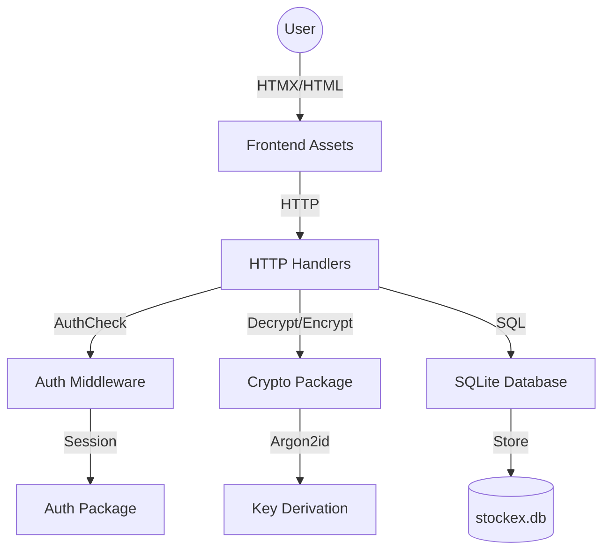

# StockEx - Secure Password Manager

StockEx is a premium, secure, and fast password manager built with **Go**, **HTMX**, and **SQLite**. It features a modern dark-mode interface and a zero-trust security model where encryption keys never touch the persistent storage.

## 🚀 Key Features

- **Dynamic Encryption**: Keys are derived using **Argon2id** from your master password and a unique per-user salt.
- **System Clipboard Integration**: Copy passwords securely with visual feedback.
- **HTMX Powered**: Smooth, single-page experience without full page reloads.
- **Admin Panel**: Manage users and roles directly from the application.
- **Registration CAPTCHA**: Built-in security check to prevent automated signups using `github.com/dchest/captcha`.
- **Account Validation**: New user registrations require administrator approval before access is granted.
- **Custom Modal System**: Enhanced UI experience with premium, styled modals replacing all native browser `alert` and `confirm` dialogs.
- **Deduplication**: Automatic detection of duplicate entries during Chrome CSV imports.
- **UI Enhancements**: Modern dark-mode design with smooth transitions and responsive layouts.
- **Multi-language Support**: Fully internationalized UI (English & French supported) with automatic browser language detection.
- **Docker Ready**: Deploy anywhere in seconds.
- **External Configuration**: Flexible settings via `config.json`.
- **Unit Tested**: Comprehensive test suite ensuring code reliability.

## 🏗️ Architecture



### Security Model
- **Hashing**: User passwords are saved as **bcrypt** hashes.
- **Encryption**: Password entries are encrypted with **AES-256-GCM**.
- **Key Storage**: The Master Key is derived at login and stored exclusively in the **encrypted session cookie**. It is never saved in the database.

## 🛠️ Tech Stack

- **Backend**: Go 1.23+
- **Frontend**: HTML5, Vanilla CSS, HTMX
- **Database**: SQLite3
- **DevOps**: Docker, Debian-slim

## 📦 Installation & Setup

### Local Run
1. Ensure you have Go installed.
2. Build the app:
   ```bash
   go build -o stockex main.go
   ```
3. Run it:
   ```bash
   ./stockex
   ```

### Docker Deployment
1. Build the image:
   ```bash
   docker build -t stockex .
   ```
2. Run the container:
   ```bash
   docker run -p 8080:8080 stockex
   ```

## ⚙️ Configuration

Modify `config.json` to adjust application settings:

| Key | Description | Default |
|-----|-------------|---------|
| `app_name` | Name displayed in the UI | `StockEx` |
| `listen_ip` | IP address to bind to | `0.0.0.0` |
| `listen_port`| Server port | `8080` |
| `session_key`| Secret for session encryption | `super-secret-key` |

## 🌍 Internationalization (i18n)

StockEx supports multiple languages. Text translations are stored in external JSON files located in the `i18n/` directory:

- `i18n/en.json`: English translations (default).
- `i18n/fr.json`: French translations.

The application automatically detects the browser's preferred language through the `Accept-Language` HTTP header. If a translation key is missing in the detected language, it falls back to English.

## 📱 Mobile API

StockEx provides a REST API under `/api/v1` for mobile integration. All requests/responses use JSON.

### Endpoints

- **Auth**:
  - `POST /api/v1/login`: `{username, password}`
  - `POST /api/v1/signup`: `{username, password}`
- **Passwords**:
  - `GET /api/v1/passwords`: Returns all entries.
  - `POST /api/v1/passwords`: `{site, username, password, notes}`
  - `PUT /api/v1/passwords`: `{id, site, username, password, notes}`
  - `DELETE /api/v1/passwords`: `{id}`
  - `POST /api/v1/passwords/decrypt`: `{encrypted_password}`

> [!IMPORTANT]
> Authentication for the API uses a **Persistent Token-based** mechanism. After a successful login or signup, the server returns a `token`. This token is stored in the database (with the encrypted master key) and remains valid across server restarts. It must be included in all subsequent requests in the **`X-API-Token`** header.

## 🧩 Chrome Extension (Autofill)

StockEx comes with a companion Chrome extension that automatically detects login forms and fills them using your vault entries.

### Installation
1. Open Chrome and navigate to `chrome://extensions/`.
2. Enable **"Developer mode"** (top right).
3. Click **"Load unpacked"** and select the `extension/` directory from this repository.

### Configuration
1. Click the StockEx icon in your extension bar.
2. Enter your server address (default: `http://localhost:8080`).
3. Login with your StockEx credentials.
4. The extension will now automatically detect login fields on websites matching your vault entries.

## 🛡️ Admin Access
The default administrator account is:
- **Username**: `admin`
- **Password**: `admin123`

---
*Built with ❤️ by the StockEx Team.*
