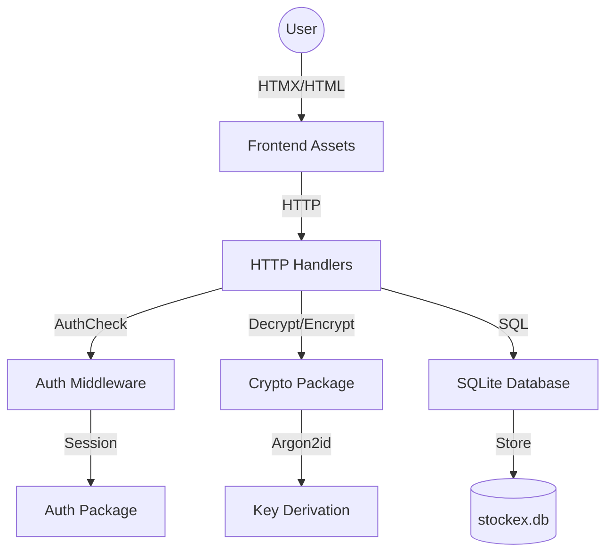

# StockEx - Secure Password Manager

StockEx is a premium, secure, and fast password manager built with **Go**, **HTMX**, and **SQLite**. It features a modern dark-mode interface and a zero-trust security model where encryption keys never touch the persistent storage.

## 🚀 Key Features

- **Dynamic Encryption**: Keys are derived using **Argon2id** from your master password and a unique per-user salt.
- **System Clipboard Integration**: Copy passwords securely with visual feedback.
- **HTMX Powered**: Smooth, single-page experience without full page reloads.
- **Admin Panel**: Manage users and roles directly from the application.
- **Docker Ready**: Deploy anywhere in seconds.
- **External Configuration**: Flexible settings via `config.json`.

## 🏗️ Architecture



### Security Model
- **Hashing**: User passwords are saved as **bcrypt** hashes.
- **Encryption**: Password entries are encrypted with **AES-256-GCM**.
- **Key Storage**: The Master Key is derived at login and stored exclusively in the **encrypted session cookie**. It is never saved in the database.

## 🛠️ Tech Stack

- **Backend**: Go 1.23+
- **Frontend**: HTML5, Vanilla CSS, HTMX
- **Database**: SQLite3
- **DevOps**: Docker, Debian-slim

## 📦 Installation & Setup

### Local Run
1. Ensure you have Go installed.
2. Build the app:
   ```bash
   go build -o stockex main.go
   ```
3. Run it:
   ```bash
   ./stockex
   ```

### Docker Deployment
1. Build the image:
   ```bash
   docker build -t stockex .
   ```
2. Run the container:
   ```bash
   docker run -p 8080:8080 stockex
   ```

## ⚙️ Configuration

Modify `config.json` to adjust application settings:

| Key | Description | Default |
|-----|-------------|---------|
| `app_name` | Name displayed in the UI | `StockEx` |
| `listen_ip` | IP address to bind to | `0.0.0.0` |
| `listen_port`| Server port | `8080` |
| `session_key`| Secret for session encryption | `super-secret-key` |

## 🛡️ Admin Access
The default administrator account is:
- **Username**: `admin`
- **Password**: `admin123`

---
*Built with ❤️ by the StockEx Team.*
